# AutoEncoder using RNN

## Structures

| *Version* | *Encoder* | *Decoder*|
| :---: | :---: | :---: |
| cnn_ae | Conv | DeConv | |
| rnn_ae | RNN | RNN | |
| lstm_ae | LSTM | LSTM | 
| gru_ae | GRU | GRU | 
| crnn_ae | Conv-RNN | RNN-DeConv |
| clstm_ae | Conv-LSTM | LSTM-DeConv |
| cgru_ae | Conv-GRU | GRU-DeConv |
| resrnn_ae | Conv-Res-RNN | RNN-DeConv | 
| reslstm_ae | Conv-Res-LSTM | LSTM-DeConv | 
| resgru_ae | Conv-Res-GRU | GRU-DeConv |

## Results

Results below are ran for 300 epoches.

| *Version* | *Plots* | *Train MSE* | *Test MSE* |
| :---: | :---: | :---: | :---: |
| Ground Truth | 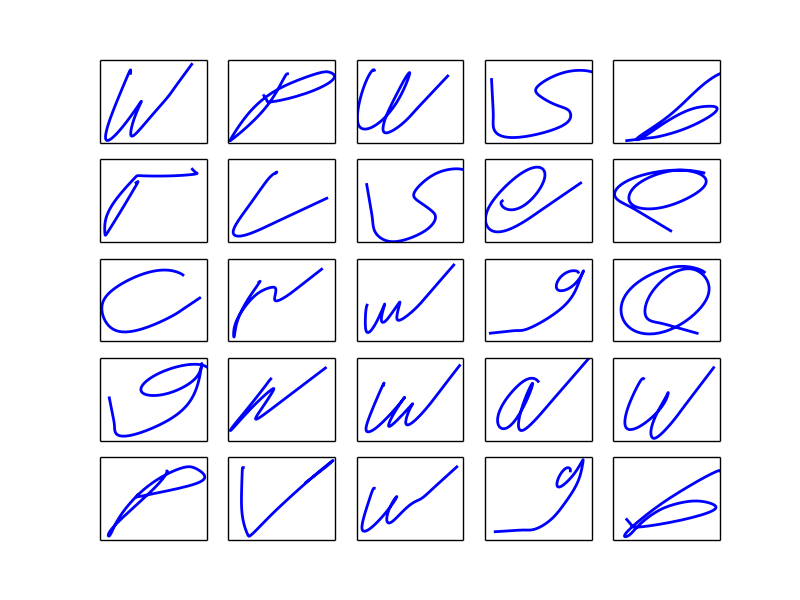 | - | - |
| cnn_ae | 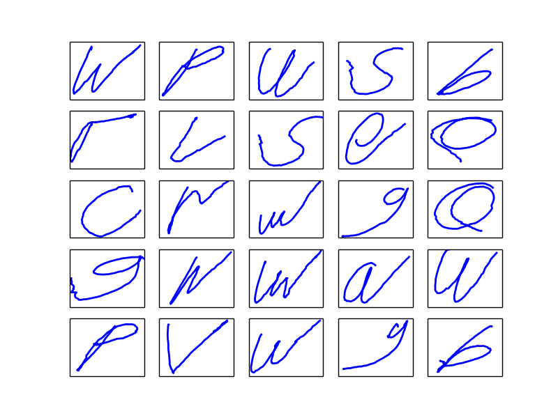 | 0.74 | 1.19 |
| rnn_ae | 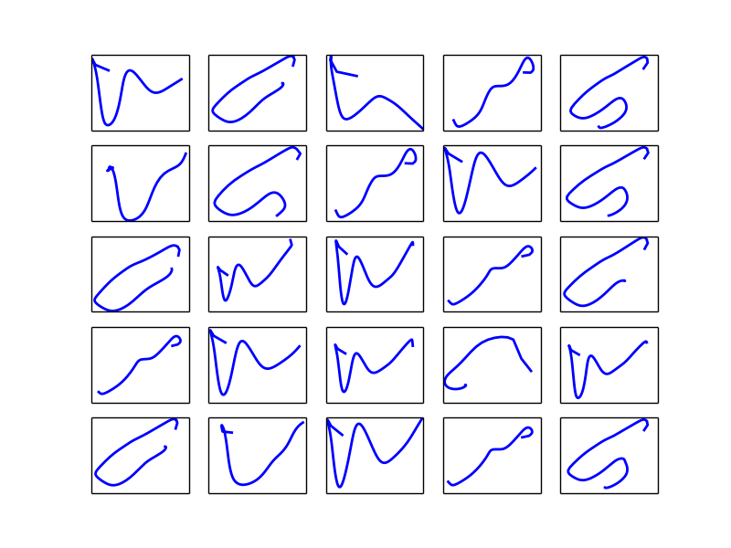 | 94.97 | 102.43 |
| lstm_ae | 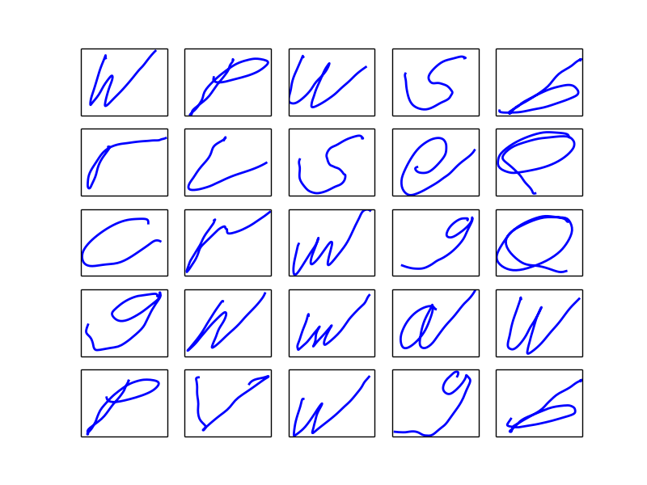 | 2.42 | 4.00 |
| gru_ae | 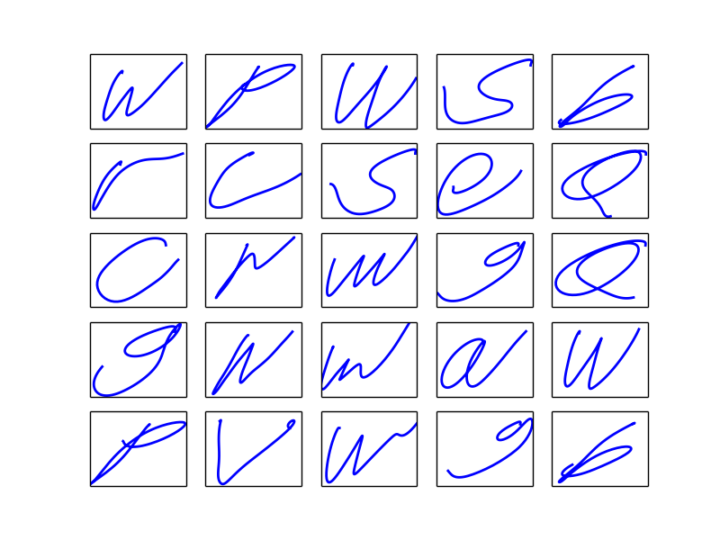 | 5.55 | 8.29 |
| crnn_ae | 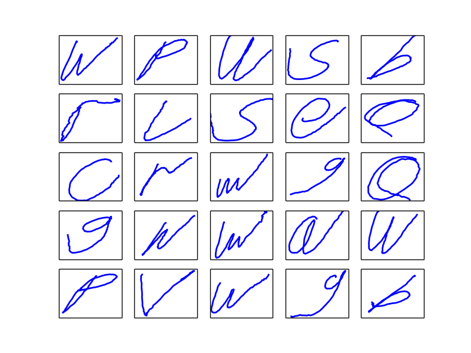 | 1.36 | 2.41 |
| clstm_ae | 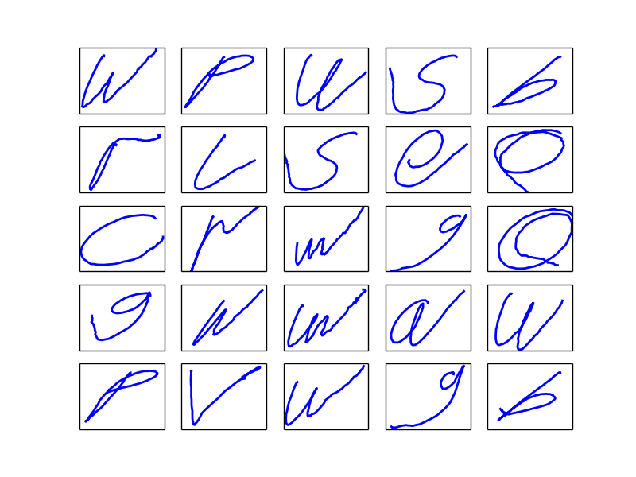 | 1.09 | 1.49 |
| cgru_ae | 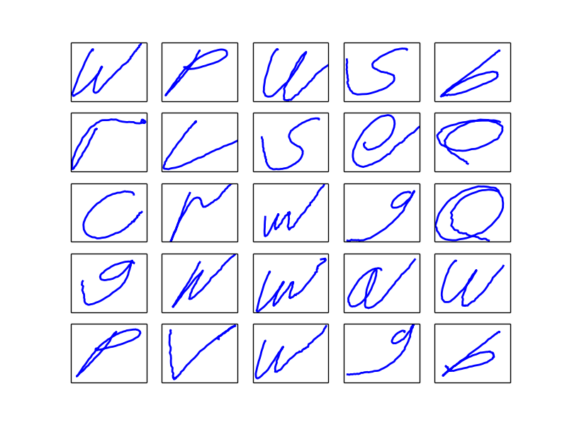 | 1.03 | 1.41 | 
| resrnn_ae | 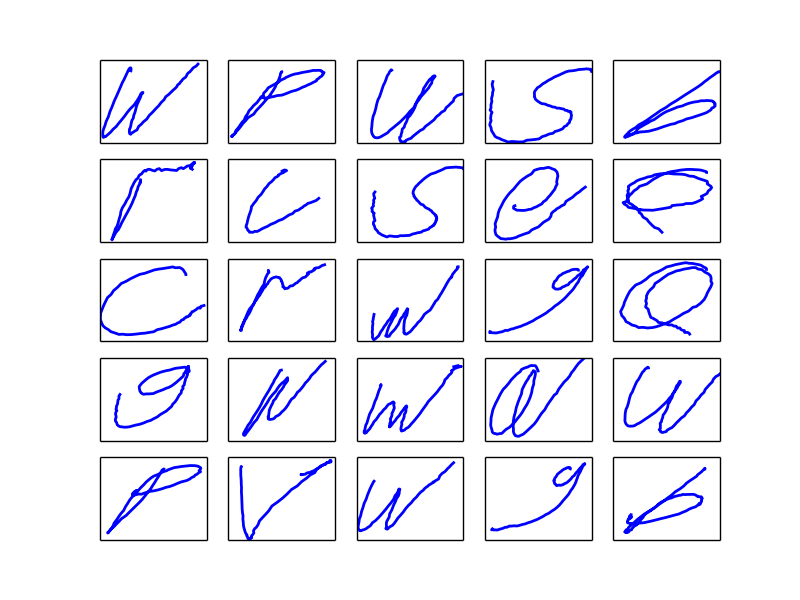 | 1.00 | 2.63 |
| reslstm_ae | 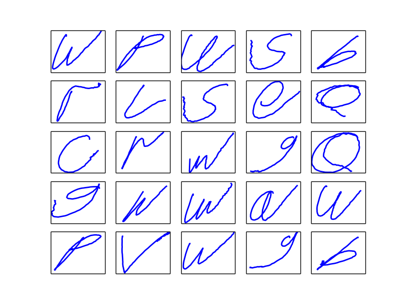 | 0.87 | 1.57 |
| resgru_ae | 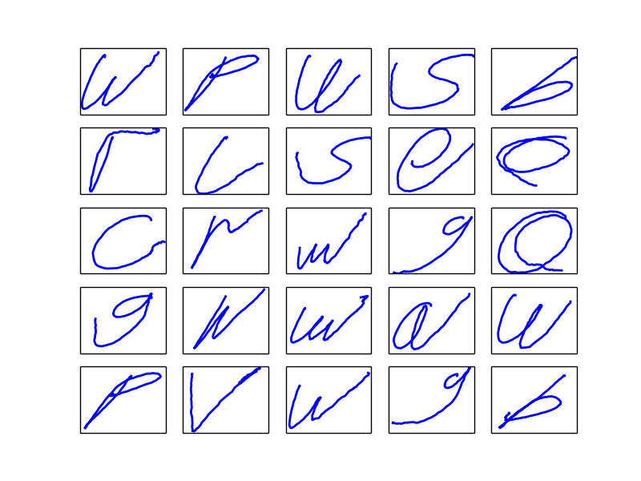 | 0.85 | 1.58 |

## Tips

1. The start point of Trajectory should be zero.
2. Amplitude normalization for Trajectory would cause bad reconstruction performance.

## Reference

[A Gentle Introduction to LSTM Autoencoders](https://machinelearningmastery.com/lstm-autoencoders/)
[Unsupervised Learning of Video Representations using LSTMs](https://arxiv.org/abs/1502.04681)
[Understanding Variational Autoencoder](https://tianjun.me/essays/Understanding_Variational_Autoencoder)
[Variational Autoencoder: Intuition and Implementation](https://wiseodd.github.io/techblog/2016/12/10/variational-autoencoder/)
[Variational Autoencoders Explained](http://kvfrans.com/variational-autoencoders-explained/)
[Automatic Differentiation Variational Inference](https://arxiv.org/abs/1603.00788)
[keras-temporal-autoencoder](https://github.com/mmontana/keras-temporal-autoencoder)
[variational-autoencoder](https://github.com/kvfrans/variational-autoencoder)
